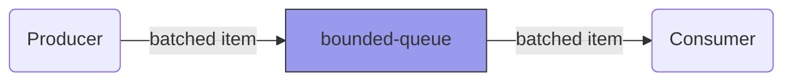

[](https://github.com/Borewit/bounded-queue/actions/workflows/nodejs-ci.yml)
[](https://npmjs.org/package/bounded-queue)

# bounded-queue

`bounded-queue` helps solves the [producer–consumer problem](https://en.wikipedia.org/wiki/Producer%E2%80%93consumer_problem).


The `bounded-queue` allows the producer and consumer to operate in 

# Introduction

Imagine you have to read records from a database and write those to another database.
A simple way to that move the records is to first read from database _A_ and sequentially write each record to database _B_.

```js
let batchNr = 0;
let items2produce = 10;

/**
 * Mockup database A, producer
 */
const dbA = {
    readRecord: async () => {
        ++batchNr;
        console.log("Producing batch #", batchNr);
        await new Promise(resolve => setTimeout(resolve, 100));
        console.log("Produced  batch #", batchNr);
        return batchNr;
    },
    moreRecordsAvailable: () => batchNr < items2produce
}

/**
 * Mockup database B, consumer
 */
const dbB = {
    async writeRecord(batchNr) {
        console.log("Consuming batch #", batchNr);
        await new Promise(resolve => setTimeout(resolve, 100));
        console.log("Consumed  batch #", batchNr);
    }
}

/**
 * Sequential conversion
 */
async function convertDatabaseRecords() {

    while(dbA.moreRecordsAvailable()) {
        const record = await dbA.readRecord();
        // Consumer
        await dbB.writeRecord(record); // expensive async write (consume) operation
    }
}

(async () => {
    console.time("no-queue");
    await convertDatabaseRecords();
    console.timeEnd("no-queue");
})();
```
In the previous example, we either read from database A, or write to database B. 
It would be faster if read from database A, while we write to database B, at the same time.
As `dbA.readRecord()` and dbB.readRecord()` are `async` functions, there is no need to introduce threading to accomplish that.  

The `bounded-queue` helps you with that. The following example uses `bounded-queue`, with a maximum of 3 queued records:

```js
import {queue} from 'bounded-queue';

let batchNr = 0;
let items2produce = 10;

/**
 * Mockup database A, producer
 */
const dbA = {
    readRecord: async () => {
        ++batchNr;
        console.log("Producing batch #", batchNr);
        await new Promise(resolve => setTimeout(resolve, 100));
        console.log("Produced  batch #", batchNr);
        return batchNr;
    },
    moreRecordsAvailable: () => batchNr < items2produce
}

/**
 * Mockup database B, consumer
 */
const dbB = {
    async writeRecord(batchNr) {
        console.log("Consuming batch #", batchNr);
        await new Promise(resolve => setTimeout(resolve, 100));
        console.log("Consumed  batch #", batchNr);
    }
}

/**
 * Conversion using bounded-queue
 */
async function convertDatabaseRecords() {

    await queue(3, () => {
        // Producer
        return dbA.moreRecordsAvailable() ? dbA.readRecord() : null; // expenive async read (produce) operation
    }, record => {
        // Consumer
        return dbB.writeRecord(record); // expensive async write (consume) operation
    });
}

(async () => {
    console.time("bounded-queue");
    await convertDatabaseRecords();
    console.timeEnd("bounded-queue");
})();
```
Using the bounded-queue, the conversion will complete in roughly half the time.

# Installation

```shell
npm install bounded-queue
```

# API Documentation

### Producer

The producer returns (produces) a [promise](https://developer.mozilla.org/en-US/docs/Web/JavaScript/Reference/Global_Objects/Promise) which resolves the batched item tp be placed on the queue.
`null` can be returns to indicate end of the production.

### Consumer

The consumer will be called with the first batch item available on the queue.
It returns a [promise](https://developer.mozilla.org/en-US/docs/Web/JavaScript/Reference/Global_Objects/Promise), and when resolves, it indicates it can handle the next batch item.

## BoundedQueue class

### Constructor
#### `constructor(maxQueueSize: number, producer: Producer<ItemType>, consumer: Consumer<ItemType>)`
- **Parameters:**
    - `maxQueueSize` (number): Maximum number of items that can be in the queue.
    - `producer` (Producer<ItemType>): A function that produces items to be added to the queue.
    - `consumer` (Consumer<ItemType>): A function that consumes items from the queue.
- **Description:** Initializes a new `BoundedQueue` instance with the specified `maxQueueSize`, `producer`, and `consumer`.

### Methods
#### `length(): number`
- **Description:** Returns the number of items currently in the queue.
- **Returns:** The number of items in the queue.

#### `run(): Promise<void>`
- **Description:** Initiates the asynchronous processing of items in the queue. It starts filling the queue with items produced by the `producer` function and concurrently consumes items using the `consumer` function.
- **Returns:** A Promise that resolves when all items have been produced and consumed.

### Example Usage
```javascript
import { queue } from 'your-module';

// Create and run a BoundedQueue with a maximum queue size of 10
queue(10, producer, consumer)
  .then(() => {
    console.log('Queue processing completed');
  })
  .catch((error) => {
    console.error('Error during queue processing:', error);
  });
```

## Classless usage

### queue() Function
#### `queue<ItemType>(maxQueueSize: number, producer: Producer<ItemType>, consumer: Consumer<ItemType>): Promise<void>`
- **Parameters:**
    - `maxQueueSize` (number): Maximum number of items that can be in the queue.
    - `producer` (Producer<ItemType>): A function that produces items to be added to the queue.
    - `consumer` (Consumer<ItemType>): A function that consumes items from the queue.
- **Description:** A convenience function for creating and running a `BoundedQueue` instance. It takes the same parameters as the `BoundedQueue` constructor and returns a Promise that resolves when all items have been produced and consumed.
- **Returns:** A Promise that resolves when all items have been produced and consumed.

### Example Usage
```javascript
import { queue } from 'your-module';

// Create and run a BoundedQueue with a maximum queue size of 10
queue(10, producer, consumer)
  .then(() => {
    console.log('Queue processing completed');
  })
  .catch((error) => {
    console.error('Error during queue processing:', error);
  });
```
